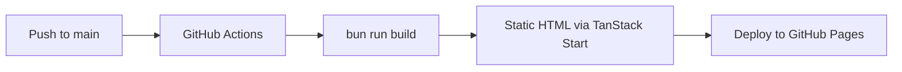

# 🚀 Show Off My Best

<p align="center">
  <strong>Personal portfolio site for <strong>Carlos</strong> — Senior Platform & Framework Engineer</strong>
</p>

<p align="center">
  <em>Hybrid Windows platforms · React Native Windows · WebView2 · .NET</em>
</p>

<p align="center">
  <a href="https://i-xarlos.github.io/my-best/">Live Demo</a> · 
  <a href="https://github.com/i-xarlos/my-best/issues">Report Bug</a> · 
  <a href="https://github.com/i-xarlos/my-best">Source Code</a>
</p>

---

## ✨ Features

- 🎨 **Modern UI** — Clean, responsive design with smooth animations
- ⚡ **Blazing Fast** — Static site generation with instant load times
- 🔒 **Type Safe** — Built with TypeScript for reliability
- ♿ **Accessible** — WCAG compliant with Radix UI primitives
- 🌙 **Dark Mode** — Automatic theme switching based on system preference
- 📱 **Mobile First** — Responsive across all device sizes

## 🛠️ Tech Stack

| Category       | Technology                                          |
| -------------- | --------------------------------------------------- |
| Framework      | [TanStack Start](https://tanstack.com/start)        |
| UI Library     | [React 19](https://react.dev/)                      |
| Build Tool     | [Vite](https://vitejs.dev/)                         |
| Language       | [TypeScript](https://www.typescriptlang.org/)       |
| Styling        | [Tailwind CSS v4](https://tailwindcss.com/)         |
| Animations     | [Framer Motion](https://www.framer.com/motion/)     |
| Components     | [Radix UI](https://www.radix-ui.com/)               |
| Icons          | [Lucide React](https://lucide.dev/)                 |

## 📁 Project Structure

```
src/
├── assets/          # Images and static files
├── components/
│   └── ui/          # Reusable UI components (Radix + shadcn/ui)
├── hooks/           # Custom React hooks
├── lib/             # Utilities and helpers
├── routes/          # TanStack Router file-based routes
│   ├── __root.tsx   # Root layout
│   └── index.tsx    # Home page (portfolio)
├── router.tsx       # Router configuration
├── server.ts        # SSR entry
├── start.ts         # App entry
└── styles.css       # Global styles
```

## 🚀 Getting Started

### Prerequisites

- [Node.js](https://nodejs.org/) v18+
- [Bun](https://bun.sh/) (recommended) or npm/yarn

### Installation

```bash
# Clone the repository
git clone https://github.com/i-xarlos/my-best.git
cd my-best

# Install dependencies
bun install
```

### Development

```bash
# Start dev server (http://localhost:3000)
bun run dev

# Build for production
bun run build

# Preview production build
bun run preview
```

### Code Quality

```bash
# Lint code
bun run lint

# Format code
bun run format
```

## 📄 Sections

| Section      | Description                                          |
| ------------ | ---------------------------------------------------- |
| 🏠 Hero      | Intro, role highlights and call-to-action            |
| 👤 About     | Platform engineer philosophy and approach            |
| 🎯 Specialties | Six core focus areas — architecture to performance |
| 💻 Stack     | Microsoft ecosystem, JS/TS and engineering practices |
| 💼 Experience | Career timeline with key roles                      |
| 📧 Contact   | Email, LinkedIn, GitHub, Twitter and phone           |

## 🌐 Links

| Platform   | Link                                                  |
| ---------- | ----------------------------------------------------- |
| 🔗 GitHub  | [i-xarlos/my-best](https://github.com/i-xarlos/my-best) |
| 🐦 Twitter | [@Xarlos\_](https://twitter.com/Xarlos_)             |
| 💼 LinkedIn | [Carlos](https://www.linkedin.com/in/ixarlos/)      |
| 📧 Email   | ixarlos@gmail.com                                    |
| 🌐 Website | [i-xarlos.github.io/my-best](https://i-xarlos.github.io/my-best/) |

## 🚀 Deployment

Automatically deployed to GitHub Pages on every push to `main` via GitHub Actions.

**Live site:** [https://i-xarlos.github.io/my-best/](https://i-xarlos.github.io/my-best/)

### Setup

1. Go to **GitHub → Settings → Pages → Source**
2. Select **GitHub Actions**
3. Push to `main` — the workflow handles the rest

### How it works



## 📝 License

This is a private repository. All rights reserved.

---

<p align="center">
  Made with ❤️ by <a href="https://github.com/i-xarlos">Carlos</a>
</p>
